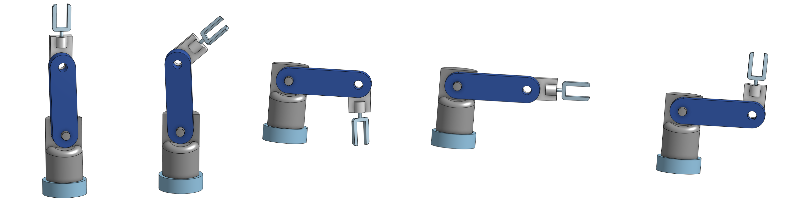

# 🤖 3D Arm Design

This project contains the 3D design of a robotic arm created using [Onshape](https://www.onshape.com/), and exported in STL format. It is part of a larger robotics project where this arm will be used in physical simulations or 3D-printed.

---

## 📌 Project Overview

The goal of this project is to:

- Design a simple robotic arm mechanism  
- Export it as a 3D model (STL)  
- Visualize different movement states  
- Use it for physical prototyping or further robotic control logic

---

## 🛠️ Tools Used

- **Onshape** for CAD modeling  
- **STL** file format for 3D printing  
- **GitHub** for version control and documentation

---

## 🖼️ Arm Movements Preview

The image below shows different positions of the arm:

---

## 🔗 Online Model Viewer

You can view the full 3D model on Onshape here:  
👉 [View on Onshape](https://cad.onshape.com/documents/557e877ff8b8c1f62fef63de/w/21eb2097e4f5241078ee5d10/e/75772f346cd864900e04646c?renderMode=0&uiState=686580dc8eac5763cf9181c9)

---

## 📁 Files Included

| File Name         | Description                         |
|------------------|-------------------------------------|
| `3D_arm_side.stl` | Side view of the 3D printed model   |
| `3D_arm_view.stl` | Full angled view for 3D printing    |

---

Made by **Safwan Alemam**
